# Sherlock

[](https://opensource.org/licenses/Apache-2.0)
[](https://golang.org/)
[](https://github.com/warm3snow/sherlock/stargazers)
[](https://github.com/warm3snow/sherlock/network/members)
[](https://github.com/warm3snow/sherlock/issues)

[English](README.md) | [中文](README_zh.md)

## Sherlock - AI-powered SSH Remote Operations Tool

Sherlock is an AI-based remote operations tool built on SSH. It enables you to interact with remote hosts using natural language commands.

### Why Sherlock Over Traditional SSH?

| Feature | Traditional SSH | Sherlock |
|---------|----------------|----------|
| **Natural Language Support** | ❌ Requires memorizing commands | ✅ Describe tasks in plain language |
| **Command History & Saved Hosts** | ❌ Manual management required | ✅ Automatic login history and host management |
| **Automation** | ❌ Requires scripting knowledge | ✅ AI-powered task automation |
| **Learning Curve** | ❌ Steep learning curve for beginners | ✅ Intuitive natural language interface |
| **Multi-step Operations** | ❌ Manual command chaining | ✅ AI understands complex tasks |
| **Cross-language Support** | ❌ English commands only | ✅ Supports commands in multiple languages |
| **Theme Support** | ❌ Plain terminal only | ✅ Multiple color themes (default, dracula, solarized) |

#### Key Advantages

1. **🗣️ Natural Language Interface** - No need to memorize complex shell commands. Simply describe what you want to do in plain English or Chinese, and Sherlock will translate it to the appropriate commands.

2. **📜 Smart History Management** - Sherlock automatically saves your connection history and host information, allowing you to quickly reconnect to previous servers with a simple `connect <id>` command.

3. **🤖 AI-Powered Automation** - Complex multi-step operations become simple one-line requests. The AI understands context and can execute sophisticated workflows automatically.

4. **🔑 Automatic SSH Key Management** - Sherlock handles SSH key authentication seamlessly. After your first password-based connection, it automatically sets up key-based authentication for future logins.

5. **🌍 Multi-language Support** - Interact with your servers in your preferred language. Sherlock understands commands in both English and Chinese.

6. **🔌 Multiple LLM Providers** - Choose from local (Ollama) or cloud-based (OpenAI, DeepSeek) AI providers based on your privacy and performance needs.

### Architecture

```mermaid
flowchart TB
    subgraph User["👤 User"]
        CLI["Command Line Interface"]
    end

    subgraph Sherlock["🔍 Sherlock Core"]
        subgraph CmdLayer["cmd/sherlock"]
            Main["Main Application"]
            Liner["Liner (readline)"]
        end

        subgraph InternalLayer["internal/"]
            Agent["Agent<br/>(NLP Processing)"]
            AIClient["AI Client"]
            Config["Config Manager"]
            History["History Manager"]
            Theme["Theme Engine"]
        end

        subgraph PkgLayer["pkg/"]
            SSHClient["SSH Client"]
            LocalClient["Local Client"]
        end
    end

    subgraph LLMProviders["🤖 LLM Providers"]
        Ollama["Ollama (Local)"]
        OpenAI["OpenAI"]
        DeepSeek["DeepSeek"]
    end

    subgraph RemoteHosts["🖥️ Remote Hosts"]
        SSH1["SSH Server 1"]
        SSH2["SSH Server 2"]
        SSHn["SSH Server N"]
    end

    CLI --> Main
    Main --> Liner
    Main --> Agent
    Main --> Config
    Main --> History
    Main --> Theme
    Main --> SSHClient
    Main --> LocalClient

    Agent --> AIClient
    AIClient --> Ollama
    AIClient --> OpenAI
    AIClient --> DeepSeek

    SSHClient --> SSH1
    SSHClient --> SSH2
    SSHClient --> SSHn
```



**Component Description:**

| Component | Path | Description |
|-----------|------|-------------|
| **Main Application** | `cmd/sherlock/` | CLI entry point, handles user interaction and command routing |
| **Agent** | `internal/agent/` | AI agent for natural language processing (connection parsing, command translation) |
| **AI Client** | `internal/ai/` | LLM client implementations using ByteDance CloudWeGo Eino framework |
| **Config** | `internal/config/` | Configuration management (JSON config file) |
| **History** | `internal/history/` | Login history and saved hosts management |
| **Theme** | `internal/theme/` | UI theme support (default, dracula, solarized) |
| **SSH Client** | `pkg/sshclient/` | SSH client implementation with PTY support for interactive commands |

### Features

1. **Natural Language Connection** - Connect to remote hosts by describing what you want in plain language
2. **Automatic SSH Key Management** - After password-based connection, automatically adds your local SSH public key to the remote host's authorized_keys for future passwordless authentication
3. **AI-powered Command Execution** - Describe what you want to do in natural language, and Sherlock will translate it to shell commands
4. **Multiple LLM Provider Support** - Works with local Ollama, DeepSeek, or OpenAI APIs using the CloudWeGo Eino framework

### Installation

#### From Source

```bash
# Clone the repository
git clone https://github.com/warm3snow/sherlock.git
cd Sherlock

# Build
go build -o sherlock ./cmd/sherlock

# Optional: Install to $GOPATH/bin
go install ./cmd/sherlock
```

### Configuration

Sherlock uses a JSON configuration file. The default location is `~/.config/sherlock/config.json`.

#### SSH Key Auto-Detection

Sherlock automatically detects SSH keys from the `~/.ssh/` directory. It prioritizes `id_ed25519` over `id_rsa`. If neither key is found, a warning message is displayed and password authentication will be used.

You typically don't need to configure SSH keys manually. If you want to override the auto-detection, you can specify the paths in the configuration file:

```json
{
  "llm": {
    "provider": "ollama",
    "base_url": "http://localhost:11434",
    "model": "qwen2.5:7b",
    "temperature": 0.7
  },
  "ssh_key": {
    "private_key_path": "~/.ssh/id_rsa",
    "public_key_path": "~/.ssh/id_rsa.pub",
    "auto_add_to_remote": true
  },
  "shell_commands": {
    "whitelist": ["mycustomcmd", "another-cmd"]
  },
  "ui": {
    "theme": "dracula"
  }
}
```

**Note:** The `ssh_key` section is optional. If omitted, Sherlock will auto-detect SSH keys.

#### UI Themes

Sherlock supports three color themes for the interactive shell:

- **default** - Simple monochrome theme (no colors)
- **dracula** - Popular dark theme with purple/pink accents
- **solarized** - Professional color scheme with blue/cyan tones

To change the theme, add the `ui` section to your configuration file:

```json
{
  "ui": {
    "theme": "dracula"
  }
}
```

#### Shell Commands Whitelist

You can add custom shell commands to the whitelist. These commands will be executed directly without LLM translation, improving execution efficiency.

```json
{
  "shell_commands": {
    "whitelist": ["mycustomcmd", "another-cmd", "custom-script"]
  }
}
```

#### LLM Providers

**Ollama (Local)**
```json
{
  "llm": {
    "provider": "ollama",
    "base_url": "http://localhost:11434",
    "model": "qwen2.5:7b"
  }
}
```

**OpenAI**
```json
{
  "llm": {
    "provider": "openai",
    "api_key": "your-api-key",
    "model": "gpt-4"
  }
}
```

**DeepSeek**
```json
{
  "llm": {
    "provider": "deepseek",
    "api_key": "your-api-key",
    "model": "deepseek-chat"
  }
}
```

### Usage

#### Start Interactive Mode

```bash
sherlock
```

#### Show Saved Hosts

```bash
sherlock hosts
```

This shows all previously connected hosts. You can then connect using `connect <id>`.

#### Command Line Options

```bash
sherlock [options] [command]

Commands:
  hosts                   Show all saved hosts

Options:
  -c, --config <path>     Path to configuration file
  -v, --version           Show version information
  -h, --help              Show help message
  --provider <provider>   LLM provider (ollama, openai, deepseek)
  --model <model>         Model name
  --base-url <url>        Base URL for LLM API
  --api-key <key>         API key for LLM provider
```

#### Interactive Commands

```
# Built-in commands
help                    Show help message
exit, quit, q           Exit Sherlock
status                  Show current status
disconnect              Disconnect from current host
hosts                   Show all saved hosts
history                 Show login history

# Connection (natural language)
connect to 192.168.1.100 as root
ssh user@example.com:2222
login to server 10.0.0.1 port 2222 as admin
connect 1                 Connect to saved host by ID

# Hosts (natural language)
show my hosts             Show all saved hosts
显示主机                   Show all saved hosts (Chinese)

# Execute commands (when connected)
$ls -la                 Execute command directly
show me disk usage      Natural language command
list running processes  Natural language command

# Interactive commands with PTY support
$top                    System monitoring with full terminal support
$htop                   Interactive process viewer
$vim /etc/hosts         Text editor with full terminal support
$less /var/log/syslog   Pager with full terminal support
```

**Note:** Interactive commands like `top`, `htop`, `vim`, `less`, etc. are automatically detected and run with full PTY (pseudo-terminal) support, allowing proper display and keyboard interaction.

### Examples

```
$ sherlock
sherlock> connect to 192.168.1.100 as root
Parsing connection request...
Connecting to root@192.168.1.100:22...
Password (leave empty to use SSH key): ****
Successfully connected to root@192.168.1.100:22
Adding public key to remote authorized_keys...
Public key added successfully. Future connections can use key authentication.

sherlock[root@192.168.1.100:22]> show me disk usage
Commands to execute:
  1. df -h
Description: Display disk space usage in human-readable format

$ df -h
Filesystem      Size  Used Avail Use% Mounted on
/dev/sda1        50G   20G   28G  42% /

sherlock[root@192.168.1.100:22]> $uptime
 14:30:01 up 45 days,  3:22,  2 users,  load average: 0.15, 0.10, 0.08

sherlock[root@192.168.1.100:22]> exit
Goodbye!
```

### Project Structure

```
Sherlock/
├── cmd/
│   └── sherlock/          # Main CLI application
├── internal/
│   ├── agent/             # AI agent for natural language processing
│   ├── ai/                # LLM client implementations (Ollama, OpenAI, DeepSeek)
│   ├── config/            # Configuration management
│   ├── history/           # Login history management
│   └── theme/             # UI theme support
├── pkg/
│   └── sshclient/         # SSH client implementation
├── go.mod
├── go.sum
└── README.md
```

### Requirements

- Go 1.18 or higher
- An LLM provider:
  - Local: [Ollama](https://ollama.ai/) with a compatible model
  - Cloud: OpenAI API key or DeepSeek API key

### License

Apache License 2.0

---

## ⭐ Star History

If you find Sherlock helpful, please consider giving it a star! Your support helps us grow and improve.

<a href="https://www.star-history.com/#warm3snow/sherlock&Date">
 <picture>
   <source media="(prefers-color-scheme: dark)" srcset="https://api.star-history.com/svg?repos=warm3snow/sherlock&type=Date&theme=dark" />
   <source media="(prefers-color-scheme: light)" srcset="https://api.star-history.com/svg?repos=warm3snow/sherlock&type=Date" />
   
 </picture>
</a>

## 🤝 Contributing

Contributions are welcome! Feel free to:

- ⭐ Star this repository if you find it useful
- 🐛 Report bugs or request features through [Issues](https://github.com/warm3snow/sherlock/issues)
- 🔧 Submit Pull Requests to help improve the project
- 📖 Improve documentation

## 💬 Contact

If you need personal assistance, please add me on WeChat: **warm3snow**

---

<p align="center">Made with ❤️ by <a href="https://github.com/warm3snow">warm3snow</a></p>