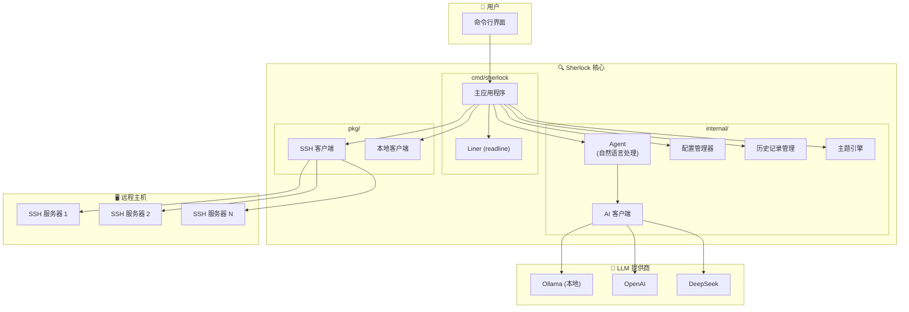

# Sherlock

[](https://opensource.org/licenses/Apache-2.0)
[](https://golang.org/)
[](https://github.com/warm3snow/sherlock/stargazers)
[](https://github.com/warm3snow/sherlock/network/members)
[](https://github.com/warm3snow/sherlock/issues)

[English](README.md) | [中文](README_zh.md)

## Sherlock - 基于AI的远程运维工具

Sherlock 是一个基于 AI 的远程运维工具，底层基于 SSH。它可以让您通过自然语言与远程主机进行交互。

### 为什么选择 Sherlock 而不是传统 SSH？

| 功能 | 传统 SSH | Sherlock |
|------|----------|----------|
| **自然语言支持** | ❌ 需要记忆命令 | ✅ 用自然语言描述任务 |
| **命令历史与主机保存** | ❌ 需要手动管理 | ✅ 自动登录历史和主机管理 |
| **自动化** | ❌ 需要脚本知识 | ✅ AI 驱动的任务自动化 |
| **学习曲线** | ❌ 对新手有较高门槛 | ✅ 直观的自然语言界面 |
| **多步操作** | ❌ 需要手动命令串联 | ✅ AI 理解复杂任务 |
| **多语言支持** | ❌ 仅支持英文命令 | ✅ 支持多种语言的命令 |
| **主题换肤** | ❌ 仅有纯终端界面 | ✅ 多种颜色主题可选（default、dracula、solarized） |

#### 核心优势

1. **🗣️ 自然语言交互** - 无需记忆复杂的 shell 命令。只需用中文或英文描述您想做的事情，Sherlock 就会将其转换为相应的命令。

2. **📜 智能历史管理** - Sherlock 自动保存您的连接历史和主机信息，让您可以通过简单的 `connect <id>` 命令快速重新连接之前的服务器。

3. **🤖 AI 驱动自动化** - 复杂的多步操作变成简单的一行请求。AI 能够理解上下文，自动执行复杂的工作流程。

4. **🔑 自动 SSH 密钥管理** - Sherlock 无缝处理 SSH 密钥认证。在首次密码连接后，它会自动设置基于密钥的认证，实现后续免密登录。

5. **🌍 多语言支持** - 使用您喜欢的语言与服务器交互。Sherlock 支持中文和英文命令。

6. **🔌 多种 LLM 提供商** - 根据您的隐私和性能需求，选择本地（Ollama）或云端（OpenAI、DeepSeek）AI 提供商。

### 架构图



**组件说明：**

| 组件 | 路径 | 描述 |
|------|------|------|
| **主应用程序** | `cmd/sherlock/` | CLI 入口点，处理用户交互和命令路由 |
| **Agent** | `internal/agent/` | AI 代理，用于自然语言处理（连接解析、命令翻译） |
| **AI 客户端** | `internal/ai/` | LLM 客户端实现，使用字节跳动 CloudWeGo Eino 框架 |
| **配置管理器** | `internal/config/` | 配置管理（JSON 配置文件） |
| **历史记录管理** | `internal/history/` | 登录历史和已保存主机管理 |
| **主题引擎** | `internal/theme/` | 界面主题支持（default、dracula、solarized） |
| **SSH 客户端** | `pkg/sshclient/` | SSH 客户端实现，支持交互式命令的 PTY |

### 主要功能

1. **自然语言连接** - 通过自然语言描述来连接远程主机
2. **自动 SSH 密钥管理** - 通过密码连接后，自动将本地 SSH 公钥添加到远程主机的 authorized_keys，实现后续免密登录
3. **AI 驱动的命令执行** - 用自然语言描述想要执行的操作，Sherlock 会将其转换为 shell 命令
4. **多种 LLM 支持** - 支持本地 Ollama、DeepSeek 或 OpenAI API，使用字节跳动 CloudWeGo Eino 框架

### 安装

#### 从源码构建

```bash
# 克隆仓库
git clone https://github.com/warm3snow/sherlock.git
cd Sherlock

# 构建
go build -o sherlock ./cmd/sherlock

# 可选：安装到 $GOPATH/bin
go install ./cmd/sherlock
```

### 配置

Sherlock 使用 JSON 配置文件，默认位置为 `~/.config/sherlock/config.json`。

#### SSH 密钥自动检测

Sherlock 会自动从 `~/.ssh/` 目录检测 SSH 密钥。优先使用 `id_ed25519`，如果没有则使用 `id_rsa`。如果两者都没有找到，会显示警告信息并使用密码登录。

通常不需要手动配置 SSH 密钥。如果需要覆盖自动检测，可以在配置文件中指定路径：

```json
{
  "llm": {
    "provider": "ollama",
    "base_url": "http://localhost:11434",
    "model": "qwen2.5:7b",
    "temperature": 0.7
  },
  "ssh_key": {
    "private_key_path": "~/.ssh/id_rsa",
    "public_key_path": "~/.ssh/id_rsa.pub",
    "auto_add_to_remote": true
  },
  "ui": {
    "theme": "dracula"
  }
}
```

**注意：** `ssh_key` 配置项是可选的。如果不配置，Sherlock 会自动检测 SSH 密钥。

#### 界面主题

Sherlock 支持三种颜色主题：

- **default** - 简洁的单色主题（无颜色）
- **dracula** - 流行的暗色主题，带有紫色/粉色强调色
- **solarized** - 专业的配色方案，使用蓝色/青色调

要更改主题，请在配置文件中添加 `ui` 部分：

```json
{
  "ui": {
    "theme": "dracula"
  }
}
```

#### LLM 提供商配置

**Ollama (本地)**
```json
{
  "llm": {
    "provider": "ollama",
    "base_url": "http://localhost:11434",
    "model": "qwen2.5:7b"
  }
}
```

**OpenAI**
```json
{
  "llm": {
    "provider": "openai",
    "api_key": "your-api-key",
    "model": "gpt-4"
  }
}
```

**DeepSeek**
```json
{
  "llm": {
    "provider": "deepseek",
    "api_key": "your-api-key",
    "model": "deepseek-chat"
  }
}
```

### 使用方法

#### 启动交互模式

```bash
sherlock
```

#### 查看已保存的主机

```bash
sherlock hosts
```

显示所有之前连接过的主机。然后可以使用 `connect <id>` 快速连接。

#### 命令行选项

```bash
sherlock [选项] [命令]

命令:
  hosts                   显示所有已保存的主机

选项:
  -c, --config <路径>     配置文件路径
  -v, --version           显示版本信息
  -h, --help              显示帮助信息
  --provider <提供商>     LLM 提供商 (ollama, openai, deepseek)
  --model <模型>          模型名称
  --base-url <URL>        LLM API 基础 URL
  --api-key <密钥>        LLM 提供商的 API 密钥
```

#### 交互式命令

```
# 内置命令
help                    显示帮助信息
exit, quit, q           退出 Sherlock
status                  显示当前状态
disconnect              断开当前连接
hosts                   显示所有已保存的主机
history                 显示登录历史

# 连接 (自然语言)
连接到 192.168.1.100 用户名 root
ssh user@example.com:2222
以 admin 身份登录服务器 10.0.0.1 端口 2222
connect 1               通过 ID 连接到已保存的主机

# 主机 (自然语言)
显示主机                 显示所有已保存的主机
show my hosts           显示所有已保存的主机

# 执行命令 (连接后)
$ls -la                 直接执行命令
查看磁盘使用情况        自然语言命令
列出运行中的进程        自然语言命令

# 交互式命令 (带 PTY 支持)
$top                    系统监控，完整终端支持
$htop                   交互式进程查看器
$vim /etc/hosts         文本编辑器，完整终端支持
$less /var/log/syslog   分页器，完整终端支持
```

**注意：** 像 `top`、`htop`、`vim`、`less` 等交互式命令会自动检测并以完整的 PTY（伪终端）支持运行，实现正确的显示和键盘交互。

### 使用示例

```
$ sherlock
sherlock> 连接到 192.168.1.100 用户名 root
正在解析连接请求...
正在连接 root@192.168.1.100:22...
密码 (留空使用 SSH 密钥): ****
成功连接到 root@192.168.1.100:22
正在添加公钥到远程 authorized_keys...
公钥添加成功，后续可使用密钥认证登录。

sherlock[root@192.168.1.100:22]> 查看磁盘使用情况
将要执行的命令:
  1. df -h
描述: 以人类可读格式显示磁盘空间使用情况

$ df -h
Filesystem      Size  Used Avail Use% Mounted on
/dev/sda1        50G   20G   28G  42% /

sherlock[root@192.168.1.100:22]> $uptime
 14:30:01 up 45 days,  3:22,  2 users,  load average: 0.15, 0.10, 0.08

sherlock[root@192.168.1.100:22]> exit
再见！
```

### 项目结构

```
Sherlock/
├── cmd/
│   └── sherlock/          # 主 CLI 应用
├── internal/
│   ├── agent/             # 自然语言处理 AI 代理
│   ├── ai/                # LLM 客户端实现 (Ollama, OpenAI, DeepSeek)
│   ├── config/            # 配置管理
│   ├── history/           # 登录历史管理
│   └── theme/             # 界面主题支持
├── pkg/
│   └── sshclient/         # SSH 客户端实现
├── go.mod
├── go.sum
└── README.md
```

### 环境要求

- Go 1.18 或更高版本
- LLM 提供商之一:
  - 本地: [Ollama](https://ollama.ai/) 及兼容模型
  - 云端: OpenAI API 密钥或 DeepSeek API 密钥

### 开源协议

Apache License 2.0

---

## ⭐ Star 趋势

如果您觉得 Sherlock 对您有帮助，欢迎给我们一个 Star！您的支持是我们持续改进的动力。

<a href="https://www.star-history.com/#warm3snow/sherlock&Date">
 <picture>
   <source media="(prefers-color-scheme: dark)" srcset="https://api.star-history.com/svg?repos=warm3snow/sherlock&type=Date&theme=dark" />
   <source media="(prefers-color-scheme: light)" srcset="https://api.star-history.com/svg?repos=warm3snow/sherlock&type=Date" />
   
 </picture>
</a>

## 🤝 参与贡献

欢迎贡献！您可以通过以下方式参与：

- ⭐ 如果觉得有用，给项目点个 Star
- 🐛 通过 [Issues](https://github.com/warm3snow/sherlock/issues) 报告 Bug 或提出新功能建议
- 🔧 提交 Pull Request 帮助改进项目
- 📖 完善项目文档

## 💬 联系方式

如果需要个人帮助，请加微信：**warm3snow**

---

<p align="center">用 ❤️ 制作 by <a href="https://github.com/warm3snow">warm3snow</a></p>
